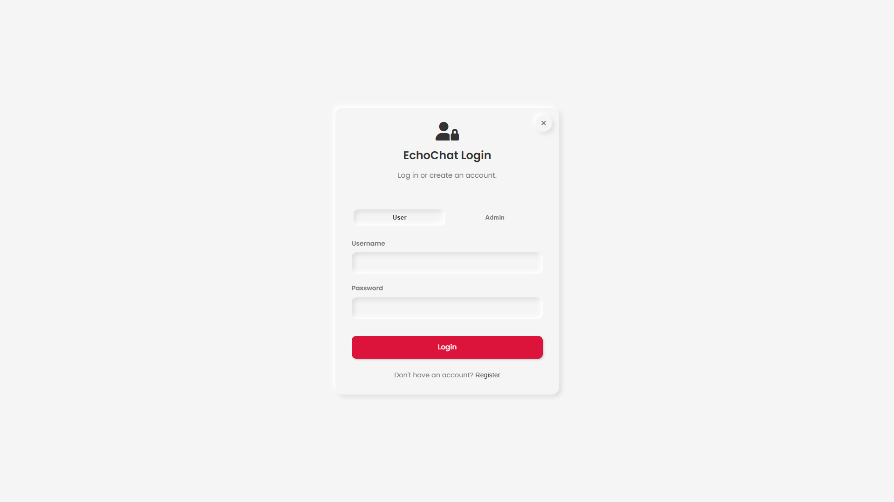

# EchoChat

**EchoChat brings real-time communication to life with a sleek, modern interface inspired by popular messengers, now wrapped in a sophisticated Black & White Neumorphic theme! Connect instantly, chat seamlessly.** 😎

<br/>
</img>

---

## 🚀 What is EchoChat? 🤔

EchoChat is a dynamic, real-time chat application built with modern web technologies 🌐 to host on your own server with databse or within your local network. Whether you're catching up one-on-one 🧑‍🤝‍🧑 or collaborating in groups 👨‍👩‍👧‍👦, EchoChat provides a fluid and visually appealing platform. It features robust user authentication 🔑, an admin dashboard for management 📊, and essential chat functionalities like presence indicators 🟢, typing notifications ✍️, and more!

The UI takes cues from popular messengers, offering a familiar yet fresh experience, enhanced by a **stunning Black & White Neumorphic design** that adapts beautifully to light and dark modes 🌓.

---

## ✨ Key Features 🌟

*   **⚡ Real-time Messaging:** Instant message delivery using WebSockets. Get your messages across *fast*! 💨
*   **👥 1-on-1 & Group Chats:** Connect privately or create group conversations for teams, friends, or family. 🗣️
*   **🎨 Modern Neumorphic UI:** Clean, tactile interface with a sophisticated **Black & White Neumorphic** aesthetic. It just *feels* good! 👌
*   **🌓 Light/Dark Mode:** Seamlessly switch themes for comfortable viewing day ☀️ or night 🌙. Your eyes will thank you! 🙏
*   **📱 Responsive Design:** Adapts smoothly to desktop 💻 and mobile devices 📱, including a slick slide-out panel for conversations on mobile! ➡️
*   **🔐 Secure Authentication:** User login, registration, and session management to keep things private. 🔒
*   **🛡️ Admin Dashboard:** For the power users! 💪
    *   View application statistics (users, messages, groups). 📈
    *   Manage users (add, delete, view). 🧑‍💼
    *   Admin-specific login via a secure Master Password. 🤫
*   **🟢 Online Presence:** See who's currently online and ready to chat! ✅
*   **✍️ Typing Indicators:** Know when someone is crafting a reply... anticipation! 👀
*   **🚫 User Blocking:** Easily block users you don't want to interact with. Peace of mind. 🧘
*   **🗑️ Message Deletion:** Oops! Did you make a typo? Users can delete their own messages. 🤫
*   **⚙️ Initial Admin Setup:** Simple onboarding process for the first administrator. Get up and running in minutes! ⏱️

---

## 🛠️ Tech Stack & Dependencies 🧱

*   **Frontend:**
    *   HTML5
    *   CSS3 (with CSS Variables for smooth theming) 💅
    *   Vanilla JavaScript (ES6+) 🍦
    *   [Font Awesome](https://fontawesome.com/) (Icons) <i class="fa-solid fa-icons"></i>
    *   [Google Fonts (Poppins)](https://fonts.google.com/specimen/Poppins) 🅰️
*   **Backend:**
    *   Node.js 🟩
    *   Express.js (Assumed - adjust if different!) 🚀
    *   WebSocket API (Likely using a library like `ws`) 🕸️
*   **Runtime:** Node.js & npm (or yarn) 📦

---

## ⚙️ Getting Started 🏁

Ready to dive in? Follow these steps to get EchoChat running locally:

### Prerequisites 📋

*   **Cloudflare Account:** Cloudflare Account is required to create the D1 (SQL) Database. ✅
*   **Cloudflare D1 (SQL) Database:** Cloudflare D1 (SQL) Database is required to run the app. ✅
*   **Node.js:** Make sure you have Node.js installed (includes npm). Download from [nodejs.org](https://nodejs.org/). Recommended version: LTS or higher. ✅
*   **npm:** Node Package Manager (comes with Node.js). ✅

### Installation & Setup 🛠️

1.  **Clone the Repository:** 📂
    ```bash
    git clone https://github.com/Md-Siam-Mia/EchoChat.git
    cd EchoChat
    ```

2.  **Install Backend Dependencies:** 🧩
    Navigate to the root directory (or backend directory if separated) and run:
    ```bash
    npm install
    ```

3.  **Configuration (Required):** 📝
    *   Fill in the required values (e.g., `DATABASE_NAME`, `DATABASE_ID` ) in the wrangler.jsonc.

4.  **Run the Application:** ▶️
    ```bash
    npm start
    # or use 
    wrangler dev
    ```
    *(This command should be defined in your `package.json`'s `scripts` section.)*

5.  **Access EchoChat:** 🎉
    *   Open your web browser 🌐 and navigate to `http://localhost:PORT` (replace `PORT` with the configured port, often 3000 or 8080).

### First Use: Admin Setup 👑

*   On the first launch (if no admin exists), you'll be guided through the **Admin Account Setup**. Create your initial admin user and the master password. Easy peasy! 👍

---

## 🚀 Usage Guide 🗺️

1.  **Register/Login:** Create a new user account or log in. 🚪
2.  **Admin Login:** Use the "Admin" tab on the login screen and enter the **Master Password** to access the dashboard. 🔑
3.  **Start Chatting:** 💬
    *   Click on a user in the left panel (desktop) or slide out the panel (mobile) to start a 1-on-1 chat.
    *   Click the "Create Group" button ( <i class="fa-solid fa-users"></i> ) to start a group chat.
4.  **Explore:** Use the buttons in headers and input areas to manage blocks 🚫, toggle themes 🌓, delete messages 🗑️, etc. Have fun exploring! 🥳

---

## 🤝 Contributing 🙌

Contributions make open source amazing! If you'd like to improve EchoChat:

1.  **Fork** the repository 🍴.
2.  Create a new **branch** (`git checkout -b feature/your-amazing-feature`) 🌱.
3.  Make your awesome changes 👨‍💻.
4.  **Commit** your changes (`git commit -m 'Add some amazing feature'`) 💾.
5.  **Push** to the branch (`git push origin feature/your-amazing-feature`) ⬆️.
6.  Open a **Pull Request** 🙏.

Please stick to the project's code style and add tests if you can! ✅

---

## 📄 License 📜

This project is licensed under the MIT License - see the `LICENSE` file (if applicable) for details.

---

## 🙏 Acknowledgements 🎉

*   Inspired by modern messaging applications and neumorphic design trends. ✨
*   Huge thanks to the creators of Font Awesome <i class="fa-brands fa-font-awesome"></i> and Google Fonts 🅰️.
*   *(Add any other shoutouts here!)* 📣

---

### Happy Chatting with EchoChat!